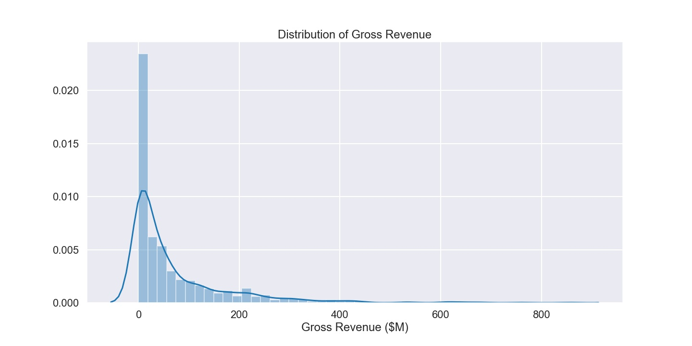
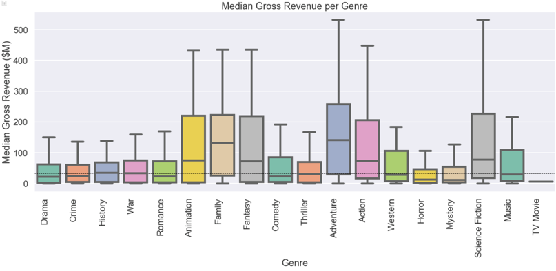
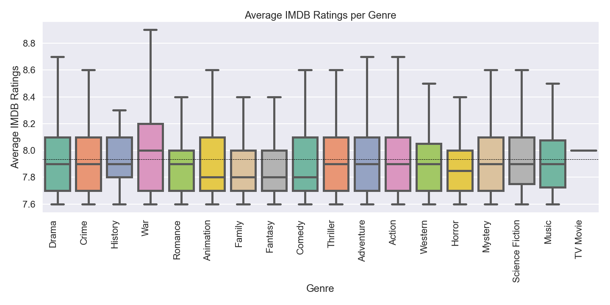
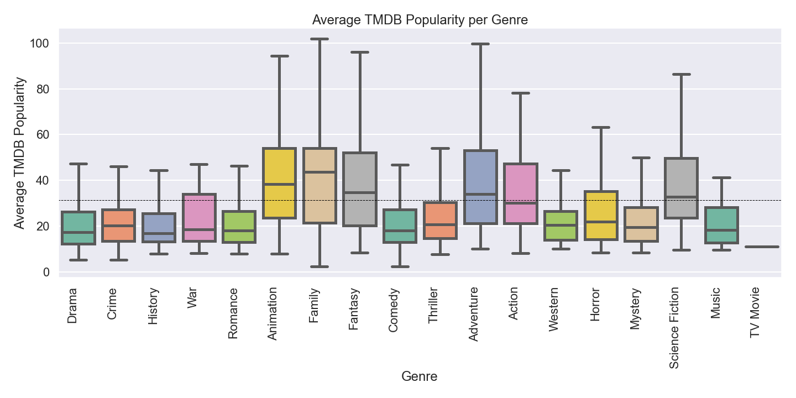
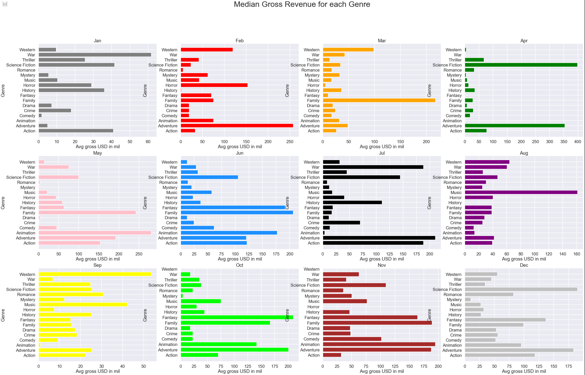
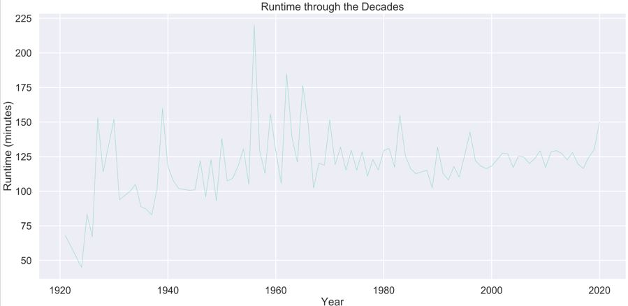

# Movie Analysis

## Project Overview

The MovieAnalysis project involves gathering data from APIs and webscraping. After the data was gathered, exploratory data analysis was used to generate insights for making recommendations for the new Microsoft Movies team. 

### Presentation Link:
  * https://docs.google.com/presentation/d/1vO2e7Su6gVlR2l-b_L3V1aV8nKcpk4_h_4QEDuCrOiU/edit?usp=sharing

### Data

#### Movie datasets are collected from:
  * IMDB website with Beautiful Soup
  * https://www.themoviedb.org/ with API call

#### The visuals were provided by manipulating the following variables:
  * Genres
  * Gross Revenues
  * Release Month
  * IMDB Ratings
  * TMDB Popularity
  * Runtime

### Graphs / Findings

#### Gross Earnings Distribution
This graph demonstrates the skewed distribution of gross earnings.

#### Distribution of Genres
This graph demonstrates the popularity of each genre from the TMDB database. Drama, thriller, and comedy are the three most popular genres based on our findings. 

#### Median Gross Earnings for each Genre
Adventure, family, animation, and action movies are the genres with the largest revenues. 

#### Mean IMDB Rating for each Genre
This boxplot demonstrates the IMDB Ratings of each genre. War movies have the highest IMDB ratings as well as the greatest range.

#### Mean TMDB Popularity for each Genre
Family movies have the highest TMDB popularity rating, followed by animation movies.

#### Monthly Median Gross Earnings for each Genre
This graph shows the median gross earnings for each genre and month.  For example, in November, animation, family, and adventure movies generated the most revenue. 

#### Runtime Through the Decades
This graph demonstrates the runtime of a movie throughout the last 100 years.

